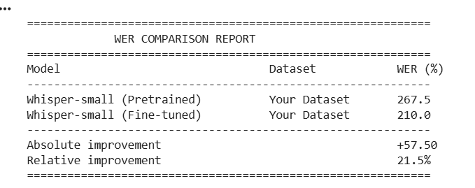
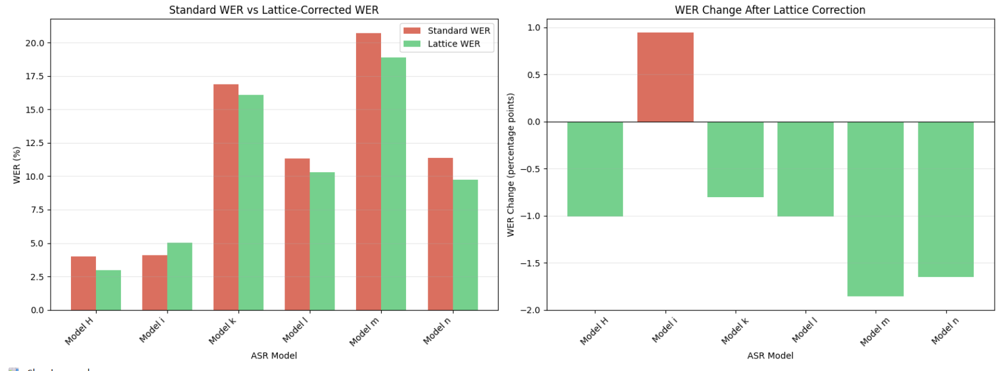

# 🎙️ Hindi Speech Recognition and Evaluation


A comprehensive suite of **four Jupyter notebooks** for Hindi Automatic Speech Recognition (ASR) — covering fine-tuning, evaluation, disfluency detection, spelling classification, and lattice-based WER analysis.

> **Designed for Google Colab** (GPU runtime recommended for fine-tuning)

---

## 🔁 System Pipeline

Audio Dataset  
↓  
Whisper Fine-Tuning  
↓  
ASR Transcription  
↓  
Disfluency Detection  
↓  
Spelling Classification  
↓  
Lattice-Based WER Evaluation

## 📑 Table of Contents

- [Notebooks](#notebooks)
- [Results & Outputs](#-results--outputs)
- [Quick Start](#-quick-start)
- [Dataset Format](#-dataset-format)
- [Tech Stack](#-tech-stack)
- [Project Structure](#-project-structure)
- [License](#-license)

##  Notebooks

### 1. Whisper Hindi Fine-Tuning (`whisper_hindi_finetuning.ipynb`)

End-to-end pipeline for fine-tuning **OpenAI's Whisper-small** on Hindi speech data.

| Step | Description |
|------|-------------|
| Setup | Install dependencies & configure model/data paths |
| Data Ingestion | Load Excel dataset, auto-fix broken GCS URLs |
| Audio Preprocessing | Resample to 16 kHz mono WAV, filter by duration (1–30s) |
| Text Normalization | Unicode NFC, punctuation cleanup, Devanagari preservation |
| Quality Checks | Remove corrupted audio, empty transcriptions, wrong language |
| Dataset Formatting | HuggingFace `Dataset` with log-mel spectrograms & tokenized labels |
| Baseline Evaluation | Pre-training WER on validation split |
| Fine-Tuning | Seq2Seq training with AdamW, FP16, early stopping |
| Post-Training | WER comparison & model export to HuggingFace Hub |

---

### 2. Disfluency Detection & Audio Clipping (`disfluency_detection.ipynb`)

Detects disfluencies in Hindi/English transcriptions and clips the corresponding audio segments.

**Disfluency Categories:**

| Category | Examples |
|----------|---------|
| Fillers | `uh`, `umm`, `मतलब`, `तो` |
| Repetitions | `मैं मैं`, `वो वो` |
| False Starts | `मैं कल… मतलब परसों गया` |
| Prolongations | `सोऽऽऽ`, `आआआ`, `soooo` |
| Hesitations | Short/abnormal duration segments |

**Pipeline:** Load Excel → Fix URLs → Download Transcription JSONs → Text Preprocessing → Disfluency Detection → Audio Clipping → CSV Export

---

### 3. Hindi Spelling Classification (`spelling_classification_pipeline.ipynb`)

Multi-layer pipeline to classify **~175,000 Hindi words** as correct or incorrect spelling.

**13-Step Pipeline:**
1. Data Collection & URL Fixing
2. Rebuild Vocabulary from FT Dataset
3. Text Normalization (Unicode NFC, invisible chars, nukta variants)
4. High-Frequency Confidence Rule
5. Protected Core Vocabulary (~200+ words)
6. Dictionary-Based Validation (~400+ words)
7. Orthographic Rule Checking (invalid matra patterns, repetitions)
8. Edit-Distance Typo Detection (Levenshtein ≤ 2)
9. English-in-Devanagari Loanword Handling (~100+ words)
10. Conservative Default Policy
11. Final Classification Logic
12. Output Generation (Excel export)
13. Final Count Reporting

---

### 4. Lattice-Based WER Pipeline (`lattice_wer_pipeline.ipynb`)

Builds a **confusion lattice** from multiple ASR model outputs to compute a fairer WER metric.

**Pipeline:**
1. Load & preprocess transcriptions from 6 ASR models + 1 human reference
2. Word-level multi-sequence alignment (Needleman-Wunsch)
3. Build confusion lattice per audio segment
4. Model consensus logic (majority vote ≥ 3/6 models)
5. Reference correction (override human errors via model agreement)
6. Dual WER computation (Standard vs Lattice-corrected)
7. Structured reporting with charts

---

## 📊 Results & Outputs

All pipeline outputs are saved in the [`outputs/`](outputs/) directory.

### 🔹 Whisper Hindi Fine-Tuning Output

Baseline vs fine-tuned WER comparison — demonstrates the improvement achieved after training on the custom Hindi dataset.



### 🔹 Lattice-Based WER Output

Standard WER vs lattice-corrected WER across ASR models — highlights how multi-model consensus reduces evaluation bias caused by human reference errors.



---

## 🚀 Quick Start

### 1. Clone the Repository

```bash
git clone https://github.com/Nitinjohri/End-to-End-Hindi-ASR-Processing-and-Evaluation-Pipeline.git
cd End-to-End-Hindi-ASR-Processing-and-Evaluation-Pipeline
```

### 2. Install Dependencies

```bash
pip install -r requirements.txt
```

### 3. Run on Google Colab

1. Upload the desired `.ipynb` notebook to [Google Colab](https://colab.research.google.com/)
2. Set runtime to **GPU** (Runtime → Change runtime type → T4 GPU) for fine-tuning
3. Upload your Excel dataset when prompted
4. Run all cells sequentially

---

## 📊 Dataset Format

All notebooks expect an **Excel file (`.xlsx`)** with columns such as:

| Column | Description |
|--------|-------------|
| `recording_id` | Unique identifier for each recording |
| `audio_url` / `audio_path` | URL or path to the audio file |
| `transcription_url` | URL to the transcription JSON |
| `transcription` | Hindi text transcription |

> **Note:** Broken JoshTalks GCS URLs are automatically fixed by each notebook.

---

## 🛠️ Tech Stack

- **Language:** Python 3.8+
- **Framework:** PyTorch, HuggingFace Transformers
- **ASR Model:** OpenAI Whisper-small
- **Audio Processing:** librosa, pydub, torchaudio, soundfile
- **NLP:** jiwer (WER), python-Levenshtein (edit distance)
- **Data:** pandas, openpyxl
- **Visualization:** matplotlib

---

## 📁 Project Structure

```
End-to-End-Hindi-ASR-Processing-and-Evaluation-Pipeline/
├── README.md
├── requirements.txt
├── .gitignore
├── notebooks/
│   ├── whisper_hindi_finetuning.ipynb          # Whisper fine-tuning pipeline
│   ├── disfluency_detection.ipynb              # Disfluency detection & audio clipping
│   ├── spelling_classification_pipeline.ipynb  # Hindi spelling classification
│   └── lattice_wer_pipeline.ipynb              # Lattice-based WER computation
└── outputs/
    ├── whisper_hindi_finetuning_output.png      # Fine-tuning WER comparison
    ├── lattice_wer_pipeline_output.png          # Lattice vs Standard WER chart
    ├── spelling_classification_output.xlsx      # Word-level classification results
    └── disfluency_results.csv                   # Segment-level disfluency annotations
```

---

## 📝 License

This project is for educational and research purposes.

---

## 🤝 Contributing

Contributions, issues, and feature requests are welcome! Feel free to open an issue or submit a pull request.
